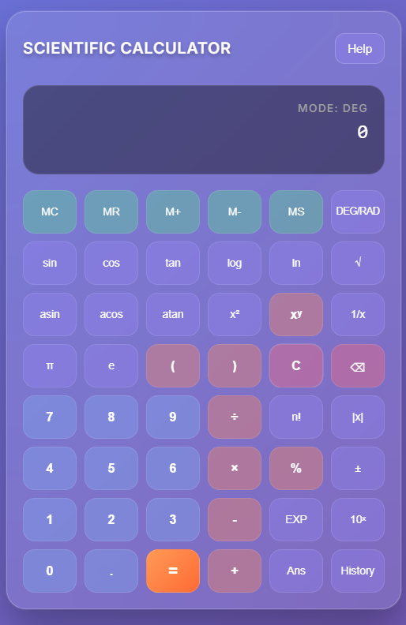
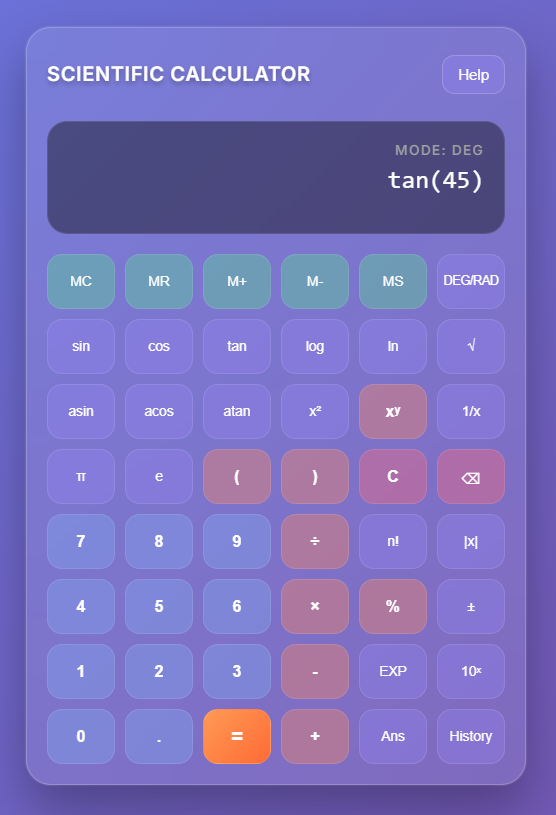
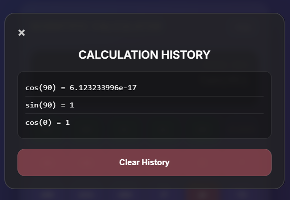
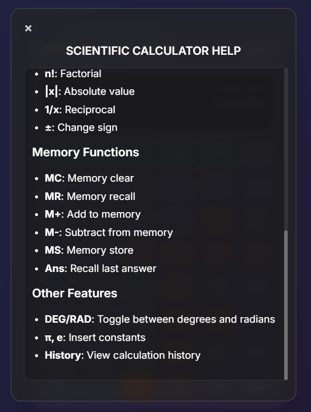

# Scientific Calculator Flask Application

A web-based scientific calculator built with Flask that provides advanced mathematical computation capabilities including trigonometric functions, logarithms, exponentials, and more.

## Features

### Basic Operations
- Addition (+)
- Subtraction (-)
- Multiplication (*)
- Division (/)
- Percentage (%)
- Square root (√)

### Scientific Functions
- **Trigonometric Functions**: sin(x), cos(x), tan(x), asin(x), acos(x), atan(x)
  - *Display behavior*: Clicking `cos` shows `cos(` in display
  - *Angle mode support*: Automatic DEG/RAD conversion
- **Logarithmic Functions**: log(x) (base 10), ln(x) (natural log)
  - *Display behavior*: Clicking `log` shows `log(` in display
- **Mathematical Functions**: 
  - √(x) - Square root (shows `√(` when clicked)
  - x² - Square (shows `^2` when clicked)
  - x^y - Power (shows `^` when clicked)
  - exp(x) - Exponential (shows `exp(` when clicked)
  - 10^(x) - Power of 10 (shows `10^(` when clicked)
  - abs(x) - Absolute value (shows `abs(` when clicked)
  - 1/x - Reciprocal (shows `1/(` when clicked)
  - n! - Factorial (shows `!` after number)
- **Constants**: π (pi), e (Euler's number)
  - *Display behavior*: Shows actual symbols π and e in expressions

### Advanced Features
- **Interactive Function Display**: Function names appear with automatic bracket opening
- **Real-time Expression Building**: See your complete expression as you build it
- **Smart Function Parsing**: Automatic evaluation of nested functions
- Memory functions (M+, M-, MR, MC, MS)
- History of calculations with complete expressions
- Clear entry (C) and backspace (⌫) functionality
- Error handling for invalid operations
- Keyboard support for all operations
- Responsive design for mobile and desktop
- Visual feedback with button animations

## Installation

1. Clone or download this repository
2. Navigate to the project directory:
   ```bash
   cd "/scientific_calculator"
   ```

3. Install required dependencies:
   ```bash
   pip install -r requirements.txt
   ```

4. Run the application:
   ```bash
   python app.py
   ```

5. Open your web browser and navigate to:
   ```
   http://localhost:5000
   ```

## Project Structure

```
scientific_calculator/
├── app.py                 # Main Flask application
├── requirements.txt       # Python dependencies
├── templates/            # HTML templates
│   ├── calculator.html   # Main calculator interface
│   └── help.html         # Help and documentation page
├── static/               # Static files (CSS, JS, images)
│   └── styles.css       # Calculator styling
└── README.md            # This file
```

## Usage Examples

### Basic Calculation
- Enter: `25 + 17 × 3`
- Display shows: `25 + 17 × 3`
- Result: `76`

### Trigonometric Function
- Click: `cos` button
- Display shows: `cos(`
- Enter: `30)` 
- Display shows: `cos(30)`
- Result: `0.866` (in DEG mode)

### Logarithmic Function
- Click: `log` button
- Display shows: `log(`
- Enter: `100)`
- Display shows: `log(100)`
- Result: `2`

### Square Root Function
- Click: `√` button
- Display shows: `√(`
- Enter: `25)`
- Display shows: `√(25)`
- Result: `5`

### Power Function
- Enter: `2`
- Click: `x²` button
- Display shows: `2^2`
- Result: `4`

### Memory Function
- Calculate: `15 + 25` then press M+
- Calculate: `10 × 2` then press MR
- Result: `40` (retrieves stored memory value)

## Screenshots

### Main Calculator Interface
<!-- Add your calculator interface screenshot here -->

*Location: Place calculator interface image in `static/images/` folder*

### Scientific Functions Panel
<!-- Add scientific functions screenshot here -->

*Location: Place scientific functions image in `static/images/` folder*

### Calculation History
<!-- Add calculation history screenshot here -->

*Location: Place history image in `static/images/` folder*

### Calculation Help
<!-- Add Calculation Help screenshot here -->

*Location: Place Calculation Help image in `static/images/` folder*

## API Endpoints

### `/` (GET)
- **Description**: Renders the main calculator interface
- **Returns**: HTML template with calculator UI

### `/calculate` (POST)
- **Description**: Processes mathematical expressions
- **Parameters**: JSON with `expression` field
- **Returns**: JSON with calculation result or error

### `/help` (GET)
- **Description**: Displays help documentation
- **Returns**: HTML help page with usage instructions

## Error Handling

The calculator handles various error scenarios:
- **Division by zero**: Returns "Error: Division by zero"
- **Invalid operations**: Returns "Error: Invalid operation"
- **Syntax errors**: Returns "Error: Invalid expression"
- **Domain errors**: Returns "Error: Invalid input for function"

## Technical Details

### Backend
- **Framework**: Flask 2.3.3
- **Python**: 3.7+
- **Math Engine**: Python's `math` module with regex parsing
- **Template Engine**: Jinja2
- **Expression Parsing**: Regular expressions for function evaluation
- **Angle Mode Support**: Automatic degree/radian conversion

### Frontend
- **HTML5**: Semantic markup with ARIA accessibility
- **CSS3**: Modern glassmorphism design with CSS Grid
- **JavaScript**: Real-time expression building and display
- **Function Display**: Automatic bracket insertion for mathematical functions
- **Keyboard Support**: Full keyboard navigation and input
- **Visual Feedback**: Ripple effects and smooth animations

### Key Functions
- `perform_calculation()`: Safely evaluates mathematical expressions with function parsing
- `replace_trig()`: Handles trigonometric function evaluation with angle mode support
- `replace_math()`: Processes mathematical functions (log, ln, exp, abs)
- `memory_functions()`: Handles memory operations
- **Function Display**: Shows function names with opening brackets automatically
- **Expression Building**: Real-time display of mathematical expressions as typed

## Configuration

### Environment Variables
Create a `.env` file in the project root:
```
FLASK_ENV=development
FLASK_DEBUG=True
SECRET_KEY=your-secret-key-here
```

### Customization
- Modify `static/styles.css` to change appearance
- Edit `templates/calculator.html` to adjust layout
- Update `app.py` to add new functions or modify behavior

## Contributing

1. Fork the repository
2. Create a feature branch
3. Make your changes
4. Test thoroughly
5. Submit a pull request

## License

This project is open source and available under the MIT License.

## Author

Vaddi Hemanth Sri Dharma Teja

## Support

For issues or questions, please check the help page at `/help` or create an issue in the repository.

---

**Note**: Remember to add your screenshot images to the `static/images/` folder and update the image paths in the README.md file above.
